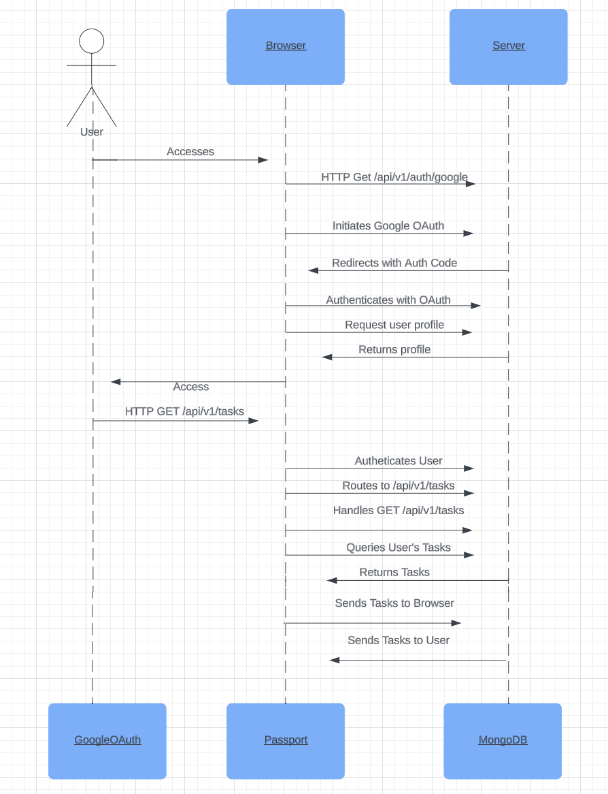

# I. Introduction:

#### Jackson Stephens
#### 11/10/2023
#### Lab 4: Node.js and Unit Testing + Rest API in Node.js

# II. Executive Summary:

I started this lab off by building a node.js application with unit tests utilizing the Jest Framework. 
Once this application was sound, I developed a RESTful API in Node.js to work cohesively 
with the application. I did so by implementing the Express.js framework, Google user authentication, 
setting up sessions and cookies, and creating endpoints for the API using CRUD functions. Once all this development 
 was finished, I recreated this application on a live cloud server. 

# III. Design Overview:

The technical design of this application involves a few key components. 
The `app/index.js` file serves as the main entry point, configuring the Express.js 
server and defining middleware for handling sessions, cookies, and authentication 
through Passport.js. The application uses MongoDB as the database, with Mongoose 
serving as the ODM (Object-Document Mapper) facilitating the interaction with said database. The 
`app/routes` folder contains route handlers, such as `auth.js` for Google authentication 
and `tasks.js` for defining CRUD functions. 

This design incorporates security by configuring secure session handling with session cookies. 
The use of Passport.js streamlines the integration of Google authentication, also keeping passwords out of plaintext in the 
GitHub repository. The API routes are protected using a custom authentication middleware to ensure that only authenticated 
users can access sensitive endpoints. Unit tests, located in `api.test.js`, then validate the functionality of 
the API, ensuring that each endpoint behaves as expected.

## UML Diagram:

The technical design explained above is illustrated with more detail in the sequence diagram below:

## Screenshots:

1. 
   - [Authorized local environment login.]
    

2. 
   - [Unauthorized local environment after logging out.]
     

3. 
   - [Session cookie/ authentication.]
     

## File Descriptions:

- **`app/index.js`:**
  - Application main entry point: configures Express.js, uses Passport.js for authentication, 
  sets up middleware, and coordinates API routes.

 - **`app/mongoose.js`:**
   - Creates a connection to the MongoDB using Mongoose. 

  - **`app/passports.js`:**
    - Configures Passport.js for authentication with Google OAuth.

- **`app/routes/auth.js`:**
  - Defines endpoints with Google Authentication with Passport.js, handling 
  the callback pathway.

- **`app/routes/tasks.js`:**
  - CRUD function utilization, aligning with the 'Task' model with methods to 
  create, read, update, and delete tasks. 

- **`app/routes/user.js`:**
  - Establishes endpoints related to user authentication.

- **`util/index.js`:**
  - Contains utility functions, including the `authenticate` middleware that's used 
  to protect API routes.

- **`app/models/Task.js`:**
  - Contains the model Mongoose schema for tasks in the MongoDB.

  - **`app/models/User.js`:**
  - Contains the model Mongoose schema for users in the MongoDB.

- **`api.test.js`:**
  - Unit tests for validating the reliability/functionality of the API.

- **`.env`:**
  - Stores environment variables used for configuration of both the live cloud server 
  and locally hosted development environment. 

# IV. Questions:

- **Name and discuss at least two of the benefits of writing unit tests before writing code.**

  1. **Early Detection of Defects or Bugs:** By writing unit tests before code, you are able to see and identify, in the 
  early stages of development, bugs and other critical issues. By doing writing unit tests before development, you are able to 
  catch problems early in the development process which saves time and money.  

  2. **Improved Design:** Writing out unit tests before code forces developers to think and plan ahead. Similar 
  to writing a rough draft for a paper, unit tests provide an excellent outline of what code needs to be written and what 
  parameters need to be fulfilled. By doing so, making the code written easier to maintain, scale, and manage. 

- **What would be some of the benefits of automating your test scripts (i.e., so they run at each commit)?**

  - **Continuous Integration:** By automatically testing scripts, developers are able to get instantaneous feedback about the impact of 
  their changes. This, compared to manual testing, is significantly faster and inexpensive. 

  - **Early Detection of Issues:** Automation allows for the early detection of issues, reducing the 
  likelihood of bugs reaching the end user product. Automation creates a more reliable and productive development 
  environment.

- **How long did this lab take you?**
  - This lab took me approximately 10 hours. 

- **List three advantages of using a web API.**
  1. **Maneuverability:** APIs enable cohesion between different systems and applications, 
  allowing them to communicate and share data seamlessly. Through this process, you are able to decrease 
  the need for labor intensive, costly remediation efforts. 

  2. **Scalability:** APIs provide a scalable architecture, allowing applications to handle increased server loads by 
  distributing tasks across multiple locations. 

  3. **Flexibility:** While using an API, there can be multiple front ends that are all being ran on the same back end: boths sides of 
  development can be changed without affecting the other. 

- **What are the differences between these four HTTP methods: GET, POST, PUT, and DELETE? Which ones are idempotent?**

  - **GET:** Used to retrieve/fetch data from the server. It is idempotent. 

  - **POST:** Used to send data to be processed, adding new data to the API. 
  It is not idempotent. 

  - **PUT:** Used to update a resource. It is idempotent.

  - **DELETE:** Used to request that data is removed. It is idempotent.

# V. Lessons Learned:

***Problem:*** Server Compatibility Errors

**Solution:** My app/models/Task.js file wasn't handling the input for my Mongoose schema properly, resulting in numerous server 
errors. After doing some research, the error code that I was receiving was as a result of a formatting error. Input working with the 
schema, or the database alike, is case sensitive. The slightest hiccup of punctuation or capitalization may result in server related 
issues. Once I fixed all the syntactical errors, the server issue was resolved. 

***Problem:*** SSL Certificate Configuration 

**Solution:** I had an issue reinitializing my SSL certificate on my live cloud server. To fix this, I had to dive into the '.env' 
configuration file and make sure all the environment variables were properly set for the different environments. I also had to change the 
ownership of the SSL certificate from my last host of the project to the current one using this command: sudo chown ubuntu -R /etc/letsencrypt. 
Once those changes were made, the problem was resolved. 

***Problem:*** CRUD Functions 

**Solution:** Implementing CRUD functions for the HTTP methods used for the '/api/v1/tasks' endpoint was incredibly challenging 
for me. After doing some research, I was able to use [Express.js documentation](https://expressjs.com/) to learn more about how to 
handle different HTTP methods. From this, I was able to learned that you should only have one 'res' or response call for each 
different method in the initial function. Each subsequent 'res' must be formatted in if/else statements to avoid errors. 

# VI. Conclusion:

- **Skills Acquired:**
  - Set up a Node.js application from the ground up.
  - Configure a noSQL MongoDB.  
  - Implement unit tests using the Jest framework. 
  - Configure and secure a RESTful API in Node.js. 
  - Deploy a Node.js application to a live cloud server. 
  - Work with Google login authentication, specifically OAuth. 
  - Adjust and configure '.env' environment variables depending on the environment being used. 
  - Apply proper documentation and code organization throughout the application. 
  - Configure proper session management with secure cookies. 

# VII. References:

1. [Express.js Documentation](https://expressjs.com/)

2. [Jest Documentation](https://jestjs.io/)

3. [Passport.js Documentation](http://www.passportjs.org/)

4. [MongoDB Atlas Documentation](https://docs.atlas.mongodb.com/)

5. [Google OAuth 2.0 Documentation](https://developers.google.com/identity/protocols/oauth2)

6. [Let's Encrypt Documentation](https://letsencrypt.org/docs/)

7. [MDN Web Docs - HTTP Methods](https://developer.mozilla.org/en-US/docs/Web/HTTP/Methods)

8. [MongoDB Node.js Driver CRUD Operations Documentation](https://www.mongodb.com/docs/drivers/node/current/fundamentals/crud/)

9. [HTTP Methods RESTful API](https://developer.mozilla.org/en-US/docs/Web/HTTP/Methods)
